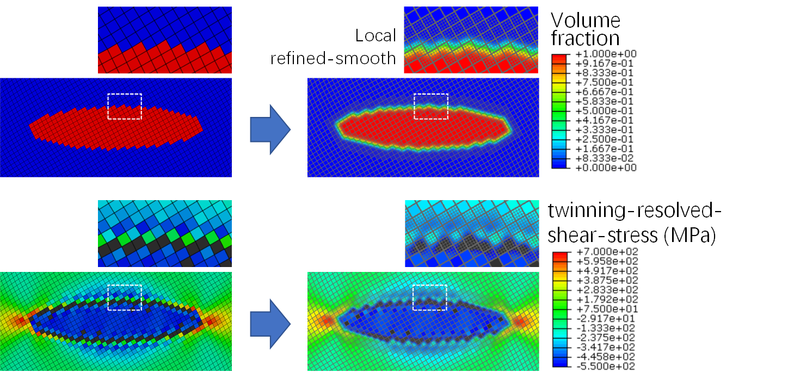
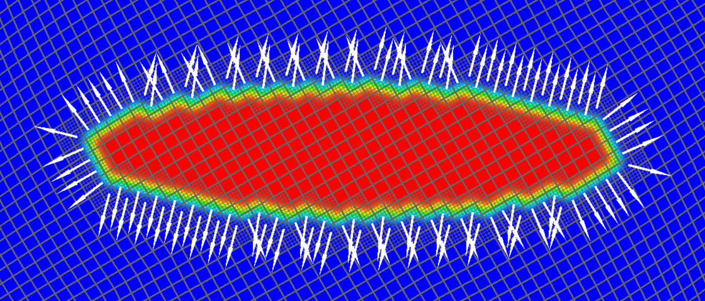
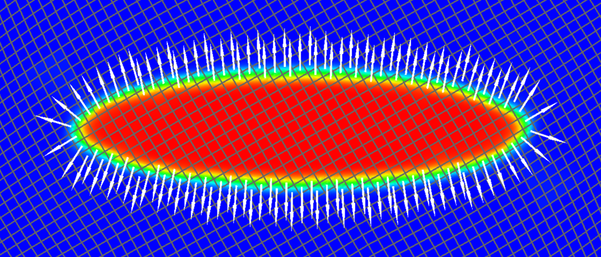

# mesh-field-smoothing

This project aim to locally refine and smooth the field at the jagged locations, given the discrete field values on a mesh; and visualize the smoothing-field on the local-refined mesh by PyOpenGL. Currently, it supports initial data file format of .inp in Abaqus, and will support much more file formats in the latter version. 

> _Fig. 1. locally refine and smooth the discrete field on the mesh, and visualize the output field with_

## Installation

Use Python interpreter to run this project. The related python libraries include **Numpy, PyTorch, PyOpenGL and Matplotlib**. It's recommended to run it on the environment of Anaconda, and use python interpreter inside Anaconda.

1. install Anaconda

2. install PyTorch on Anaconda

3. install PyOpenGL using pip of Anaconda.

   3.1 Check the pip version to see whether it comes from anaconda. Insert the following code to command line or anaconda-prompt, 

   ​	`pip --version`

   If the output looks like this: `pip 22.0.4 from D:\Anaconda3\lib\site-packages\pip (python 3.8)`, than go on to next step.

   3.2 install PyOpenGL, 

   ​	`pip install PyOpenGL PyOpenGL_accelerate`

## Quick start

Change to the folder path of this project. For example, 

`cd xxx/xxx/xxx/xxx/`

Than, you can run this to locally refine and smooth the discrete field on mesh, 

`python smooth_entire_body.py`

Give an initial data file (with format of .inp of Abaqus) containing the info of mesh. E.g., here we insert an example-file in folder ./tests, 

`please give the .inp file name (include the path):` ./tests/tilt30.inp

Than give the data file containing the info of field values on each element of the mesh, with file format of [Pandas](https://pandas.pydata.org/) type. E.g.,  we give a data file in folder ./tests, 

`please give the data file name (include the path):` ./tests/tilt30_VF_stress[15, 16, 17].txt

Choose a frame (time frame, field values vary by time frames) that you want to visualize:

 `which frame do you want? frame =` 15

Give the spreading range of Gaussian-smoothing, 

` please give the spread range for weighted average. spreadRange =` 1.5

After that, wait the program to run for a few seconds, the results are visualized by PyOpenGL with a pop-up window, so that you can see the local refined grids and the smoothed field on this mesh. In the pop-up window, 

+ the initial projection is perspective-project:
  + roll the mouse wheel to enlarge or shrink the bounding box of view volume
  + type `enter` key or `backspace` key in keyboard to enlarge or shrink the object respectively (pull away or zoom in the distance between camera and the object)
+ change projection to parallel-projection by pressing `blank` key in keyboard
  + roll the mouse wheel to enlarge or shrink the object
  + type `enter` key or `backspace` key in keyboard to enlarge or shrink the bounding box of view volume
+ press `w`, `s`, `a`, `d` to move the camera to the up-, down, left- and right- sides respectively, just like the way you operate in vedio-games

##  What's more

### visualize gradient direction

Gradient directions can be visualized as arrows simply by setting args `drawArrows=True` in function `draw_average_field()` of the class `SmoothEntireBody` , and the performance looks like this:

> Fig. 2. Arrows showing gradient directions of the smoothing-field

### other smoothing methods

There are some other methods of smoothing that performs far more better than the current Gaussian-smoothing method, which can gives much smoother interface orientations along the interface without spreading too much (or blur too much) of the original field. We will introduce these methods with details soon in the latter update of the project. Here is an outlook of the performance of our newly proposed smoothing method:

 

> Fig. 3. performances (interface -orientations, -smoothness and -thickness) of our newly proposed smoothing method by fitting (can be applied to arbitrary curve-interface, details will be released soon in the latter update version of this project)
